## a
>  1 Convert hex to base64.

En tiennyt onko pythonissa jo valmiiksi sisäänrakennetu jokin funkito, jolla tämän voisi tehdä vai pitääkö importtaa jokin library. Googletin "python hex to base64" ja ensimmäisena tuli Stack Overflow forum postaus tästä. 

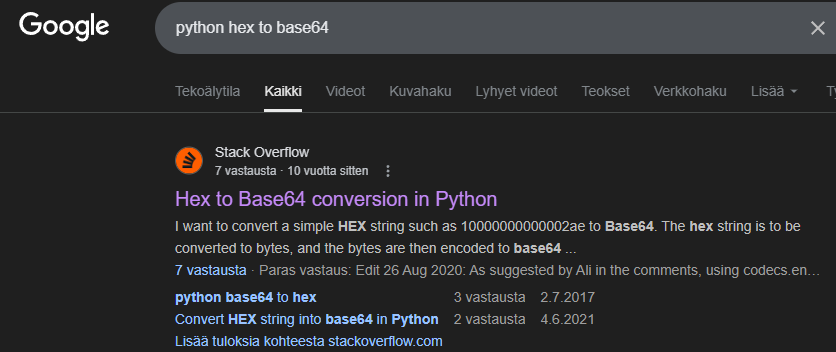

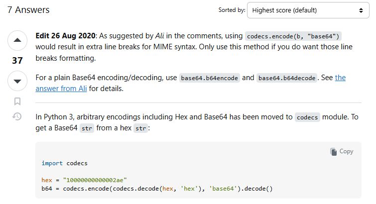

Laitoin tämän omaan python tiedostoon.

Ja se näyttää toimivan oikein. Testasin vielä nettisivulla pienemmällä hexalla ja vertasin sen antamaa outputtia oman python scriptini outputtiin.

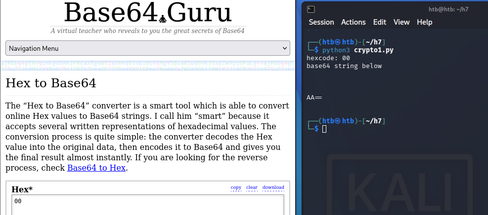

## b
> 2 Fixed XOR

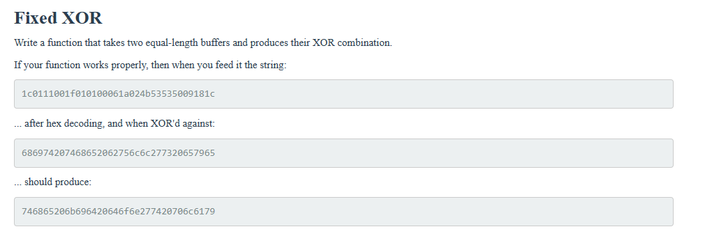

Aluksi en tiennyt yhtään mitä tässä tapahtuu tai mitä pitäisi tehdä. Seuraavaksi menikin varmaan 30min, että ymmärsin mitä tässä tapahtuu. 

Googlasin XOR calculator ja katsoin että toimiiko tämä samalla logiikalla kuin tehtävässä, eli esimerkiksi kun vertaa c ja 8  niin tulee 4. 

Täällä myös selitettiin asia samalla tavalla kuin Applied Crytpograpgy kirjassa,

Käytin netistä löydettyä hex to biniary converteria, jotta pystyisin havainnollistamaan logiikan itselleni selkeämmin

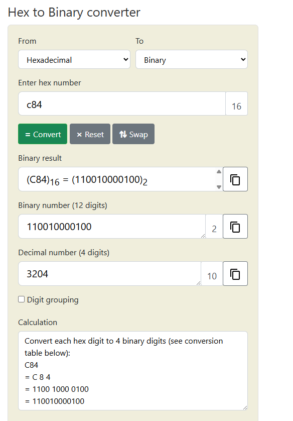

1 XOR 1 = 0
1 XOR 0 = 1
0 XOR 0 = 0
0 XOR 0 = 0

Tällein tämä toimii, lopulta aika simppeli homma. Seuraavaksi pitäisi siis tehdä python scripti, jossa tämä tapahtuisi. Itselle tulee mieleen kaksi tapaa tehdä tämä.

- Convertaan molemmat hexa "bufferit" binaariksi, vertailen ne ja convertaan sen takaisin hexaksi. 

- Käyttää jotain kirjastoa hyödyksi, josta löytyisi suoraan vertailu funktio, mikä hoitaisi tämän automaattisesti puolestani.

Lähdin testaamaan ensimmäistä, sillä en ollut hetkeen koodannut ja tämä olisi loistava hetki vähän kerrata sitä. Löysinkin hyvän sivun, jossa käytiin tätä läpi.

https://www.geeksforgeeks.org/python/python-ways-to-convert-hex-into-binary/

Halusin muuttaa parametrien nimiä ja sain tämän näköisen koodin. 

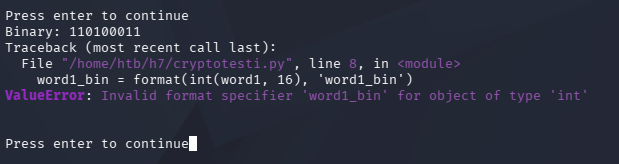

Googletin miten tämä Pythonin format methodi toimii ja löysin W3schoolsin sivun https://www.w3schools.com/python/ref_string_format.asp. Onglelma koodissani oli se, että formatin lopussa "b" ei viittaakkaan muuttujan nimeen "b". Se viittaa mihin formaattiin aikaisemmin määritetty muuttuja halutaan muuttaa.  

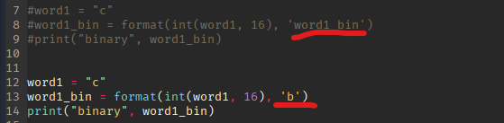

Ja nyt koodi toimii. 

Muokkasin koodia hieman paremmaksi tulevaisuutta varten.

Seuraavaksi lisäsin XOR pätkän `^`.

Ja vastauksena tuli tälläinen.

Muokkasin hieman koodia, jotta se toimisi oikein.

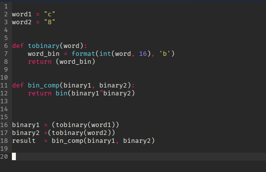

Ja nyt tuli tälläinen errori.

Ongelma on siis `tobinary` funktiossa. Katsoin tarkemmin [Geeksforgeeks](https://www.geeksforgeeks.org/python/python-ways-to-convert-hex-into-binary/) artikkelia, ja siellä oli toinen tapa muuttaa hexa integreriksi käyttämällä vain ` word_bin = int(word, 16)`

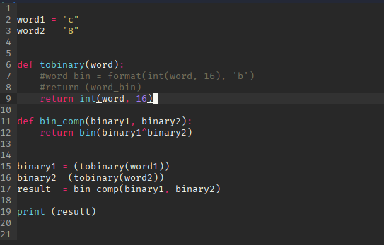

Ja nyt homma toimii. Tarkistin vastauksen online työkalulla https://www.rapidtables.com/convert/number/binary-to-hex.html  ja saatu vastaus oli oikein.

Ja lopuksi vain muuttaminen takaisin hexaksi `hex()` avulla

Mutta tuli taas samanlainen errori `type str`.

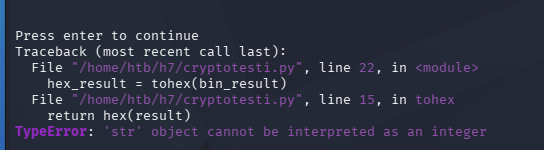

Tässä vaiheessa kysyin Geminiltä (Gemini 3 Pro) apua ja ongelma oli bin_comp funktion bin() kohdassa. Ongelma tässä oli se, että bin() muuttaa sen stringiksi. Voin ottaa pois bin funktion ja vain vertailla arvoja `^` avulla.

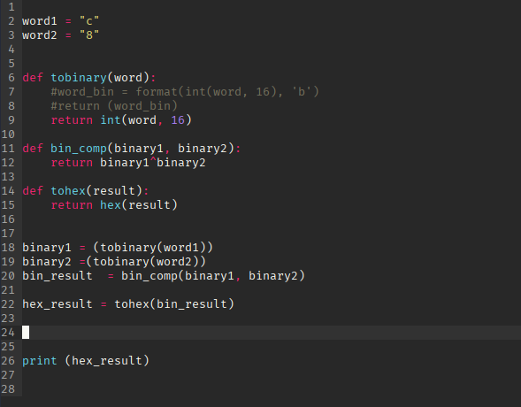

Nyt se toimii. Lisäsin vain printtiin [2:] jotta "0x" menee pois. 

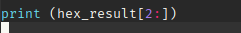

Nyt testataan sitä isommilla hexoilla. Otin tehtävän antamat hexat ja laitoin ne word1 ja word2 tilalle. Sen lisäksi laitoin tehtävän odotetun outputin ``combination`` muuttujaan ja vertailin sitä saamaani hex_result outputtiin.

Python scripti toimi ja sain oikean vastauksen. Tähän olisi varmaan ollut jokin helpompikin tapa, mutta ei tämäkään nyt ollut mitään tajunnan räjäyttävää koodia. Hieman tuli lopussa käytettyä Geminiä apuna, mutta muuten tuli koodi tehtyä ilman sitä.

## c
> Single-byte XOR cipher.
X

Tarkoituksena on siis käyttää aikaisemmin tehtyä XOR python skriptia, mutta tehdä vertailu `eli siis word1^word2` siten, että toinen sanoista on yksi hexa merkki `0-9 &A-F, a-f`. Jokaisen vertailun jälkeen hexa pitää muuttaa ASCII muotoon. Näistä voin joko 

- tehdä listan ja katsoa itse läpi kaikki stringit
- tai kuten tehtävänannossa sanotaan teen ohjelman joka laskee eri merkkien määrän lauseessa ja palauttaisi sellaiset missä on eniten sellaisia merkkejä joita on eniten englannin kielisissä merkeissä.

Helpoin tapa on varmaan ensiksi tehdä lista ja katsoa läpi manuaalisesti. Kun olen varmistanut tämän skriptin toimivuuden voisin tehdä tuon "automatisoidun" listan.

Tämä xor cypher scripti minulta löytyy jo, mutta hexa pitäisi saada ASCII muotoon. Googlasin asiaa ja löysin artikkelin asiasta: https://bobbyhadz.com/blog/python-convert-hex-to-ascii. 

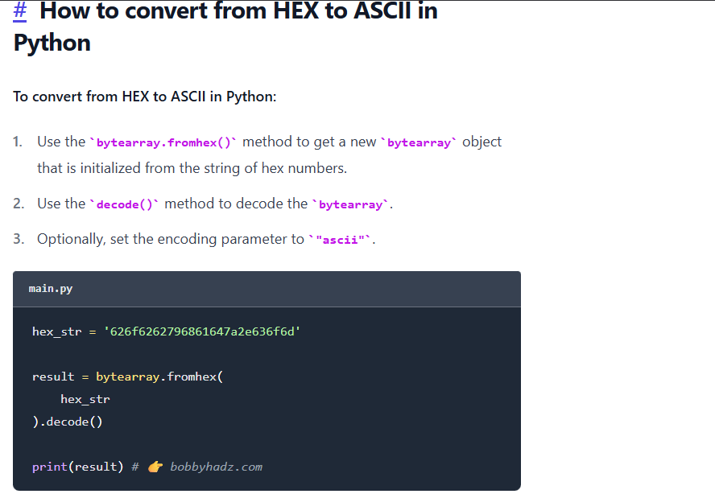

Tämä omaan koodiin:

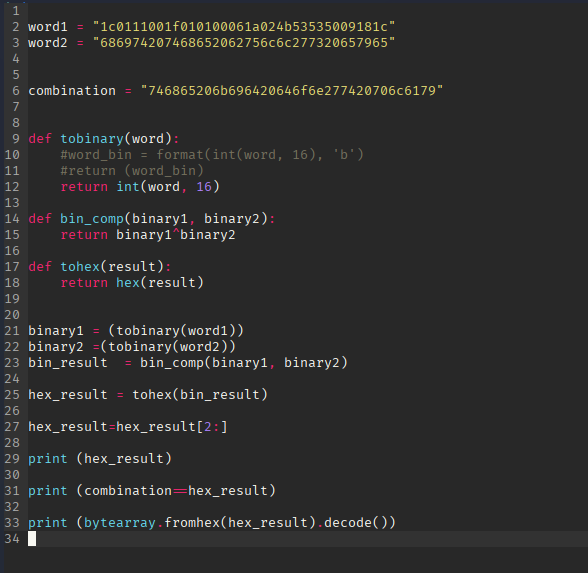

Näyttää toimivan hyvin.

Tein uuden scriptin joka toimii melkein samalla tavalla kuin viimeisen tehtävän scripti.

Mutta tämän antama printti oli tällainen

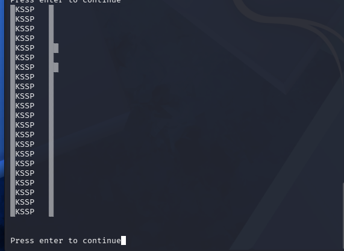

Katsoin missä kohtaa ongelma tulee

Ja ongelma ilmenee niin ``bytearray`` funktiossa sekä ``bin_comp``. Ongelma tässä on se, että kun XOR cypheraan, niin se vain tekee XOR:N viimeiseen 2 bittiin. XOR ei siis tapahdu koko bittijonolle, vaan viimeiselle kahdelle.

Tämä oli itselle liian vaikea tehtävä saada korjattua. Kysyinkin Geminiltä (Gemini 3 Pro) apua tämän ongelman ratkaisuun ja sain seuraavanlaisen koodin. 

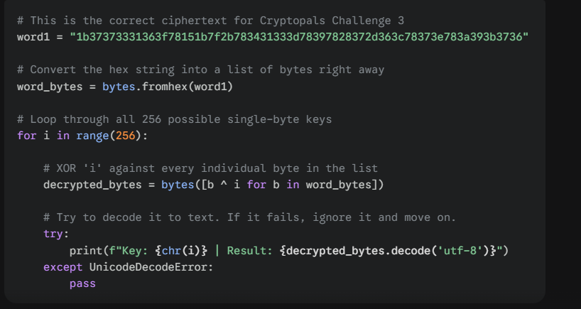

Muokkasin sitä hieman itselle kivempaan muotoon

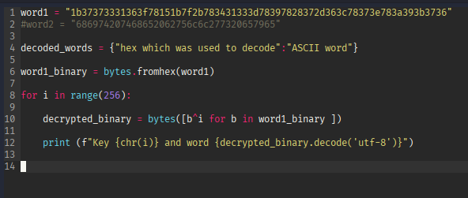

Ja sehän toimii.

Selkeästi `X` oli merkki, jolla hexa XOR cypherattiin. Seuraavaksi lähdin vielä tekemään sanakirjaa decryptatuille sanoille.

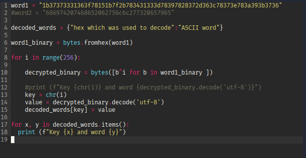

Tuli ``UnicodeDecodeError``. Laitetaan try block joka käsittelee errorin.

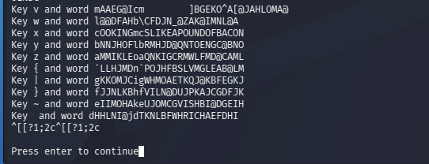

## d

# Lähteet
- https://cryptopals.com/
- https://www.geeksforgeeks.org/python/python-ways-to-convert-hex-into-binary/
- https://www.w3schools.com/python/ref_string_format.asp
- https://www.w3schools.com/PYTHON/python_operators_bitwise.asp
- https://bobbyhadz.com/blog/python-convert-hex-to-ascii
- Gemini 3 Pro